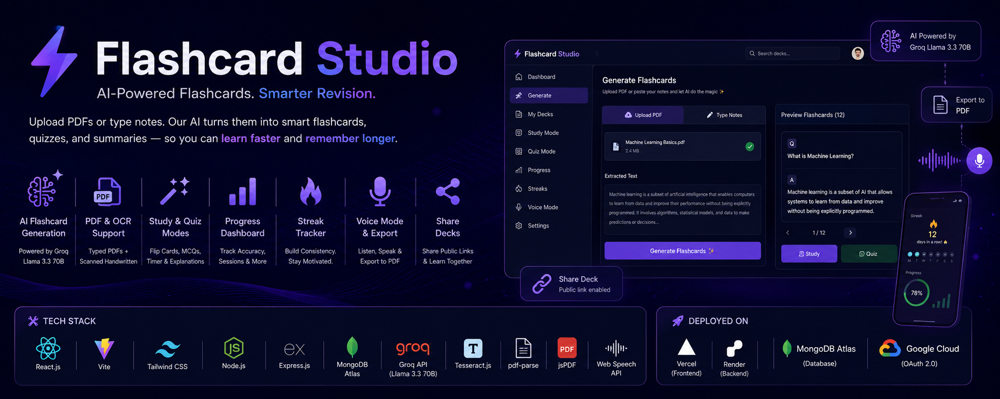
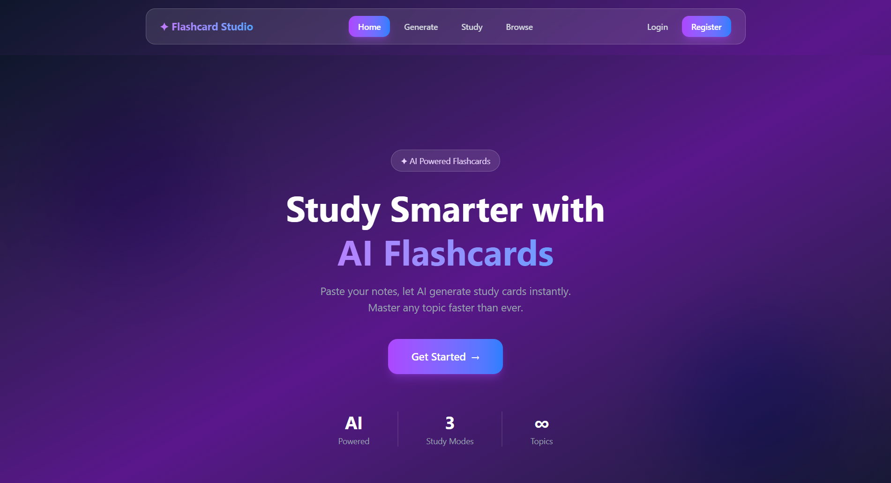
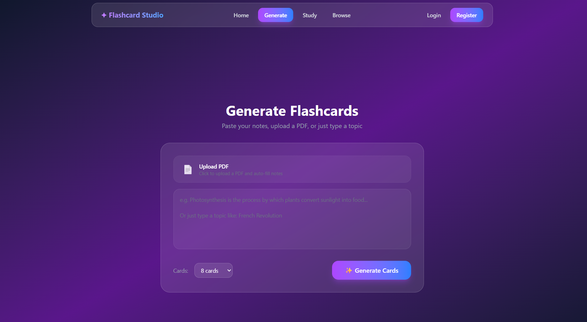
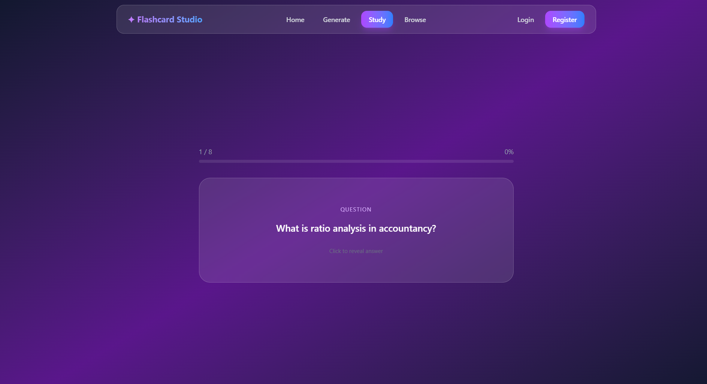
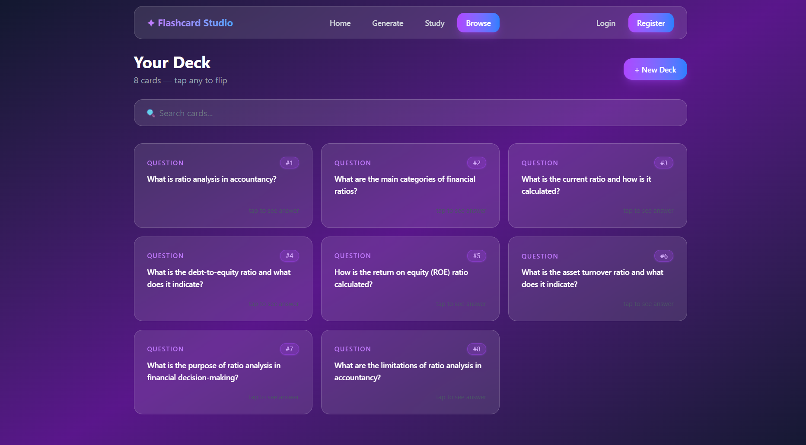
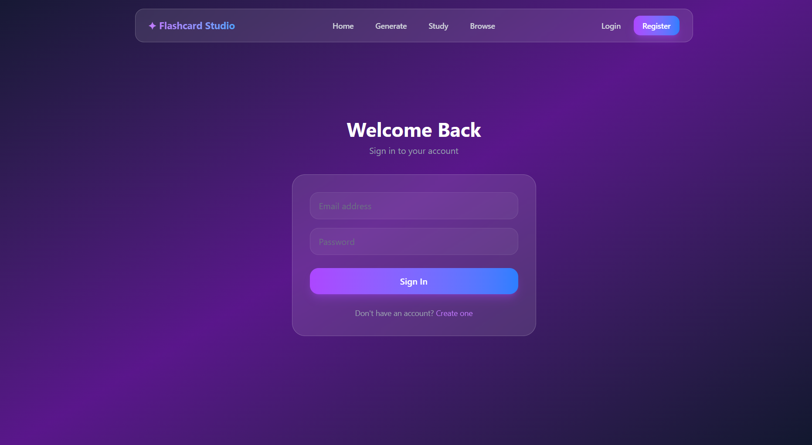
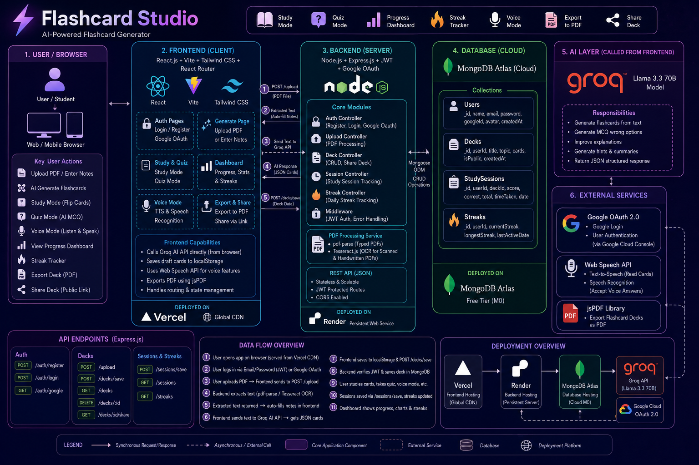

<div align="center">



# ✦ Flashcard Studio

### 🧠 Study Smarter. Learn Faster. Powered by AI.

An AI-powered flashcard generator that transforms your notes, textbooks, and PDFs into intelligent study cards in seconds.

[](https://flashcard-app-rust-five.vercel.app)
[](https://github.com/sakshamm1006/Flashcard-App)
[](https://flashcard-backend-ukz3.onrender.com)
[](https://www.linkedin.com/in/sakshammtrivedi)


</div>

---

## 📸 Screenshots

> **📌 How to add screenshots:**
> 1. Create a folder called `screenshots` in your root project folder
> 2. Take screenshots of each page and save them with these exact names:
>    - `screenshots/banner.png` → Full app banner (use the home page, crop nicely)
>    - `screenshots/home.png` → Home page
>    - `screenshots/generate.png` → Generate page with PDF upload
>    - `screenshots/study.png` → Study mode with a card flipped
>    - `screenshots/browse.png` → Browse page showing card grid
>    - `screenshots/login.png` → Login page
>    - `screenshots/quiz.png` → Quiz mode (add later when built)
>    - `screenshots/dashboard.png` → Progress dashboard (add later when built)
> 3. Use **Windows Snipping Tool** or press `Win + Shift + S` to take screenshots

| Home Page | Generate Page |
|---|---|
|  |  |

| Study Mode | Browse Page |
|---|---|
|  |  |

| Login Page | Quiz Mode |
|---|---|
|  |  |

---

## 🏗️ System Architecture

> **📌 How to add architecture diagram:**
> 1. Generate the architecture diagram using the AI prompt (ask me for it)
> 2. Save it as `screenshots/architecture.png`
> 3. It will automatically show here



### Architecture Overview

```
┌─────────────────────────────────────────────────────────────┐
│                     USER (Browser)                          │
└─────────────────────┬───────────────────────────────────────┘
                      │
          ┌───────────▼───────────┐
          │   React Frontend      │  ← Vercel CDN
          │   Vite + Tailwind     │
          └───────┬───────────────┘
                  │                    
       ┌──────────┼──────────┐
       │          │          │
       ▼          ▼          ▼
  Groq AI    Express API   LocalStorage
  (Llama 3.3) (Render.com)
       │          │
       │     ┌────▼─────┐
       │     │ MongoDB  │  ← Atlas Cloud
       │     │  Atlas   │
       │     └──────────┘
       │
  Flashcards JSON
```

---

## ✨ Features

### 🤖 AI-Powered Generation
- Paste notes or type any topic → instant AI-generated flashcards
- Powered by **Groq API** with **Llama 3.3 70B** model
- Choose 5, 8, or 12 cards per generation
- Smart prompt engineering for reliable JSON output

### 📄 PDF Support
- Upload any typed PDF → text auto-extracted and filled
- **OCR support** for scanned and handwritten PDFs (Tesseract.js)
- Works with textbooks, articles, and notes

### 📚 Study Mode
- Beautiful flip-card interface
- Progress bar tracking current position
- Mark cards as **"Got it"** or **"Still learning"**
- Round complete screen with detailed score breakdown
- Study again or generate new cards

### 🧠 Quiz Mode *(Coming Soon)*
- MCQ format with 4 options per question
- AI-generated wrong options for realistic distractors
- Timer per question
- Detailed results with review of wrong answers

### 📊 Progress Dashboard *(Coming Soon)*
- Charts showing accuracy over time
- Total cards studied and decks created
- Study session history

### 🔥 Streak Tracker *(Coming Soon)*
- Daily study streak like Duolingo
- Streak freezes and milestones
- Visual streak calendar

### 🎤 Voice Mode *(Coming Soon)*
- AI reads questions aloud via Web Speech API
- Speech recognition detects your spoken answer
- Hands-free study experience

### 📥 Export to PDF *(Coming Soon)*
- Download any deck as a formatted PDF
- Print and study offline

### 🗂️ Browse & Manage
- Grid view of all your flashcard decks
- Search cards by keyword instantly
- Card number badges (#1, #2, #3...)
- Flip any card to see answer
- Switch between multiple saved decks
- Delete unwanted decks

### 🔐 Authentication
- Email/password registration and login
- JWT-based stateless authentication
- Google OAuth login *(Coming Soon)*
- Secure logout with complete session clear

### 🎨 UI/UX
- Dark purple & blue glassmorphism design
- Fully responsive for mobile and desktop
- Smooth hover animations and transitions
- Loading spinners and status feedback
- Custom 404 page

---

## 🛠️ Tech Stack

### Frontend
| Technology | Purpose |
|---|---|
| React 18 | Component-based UI framework |
| Vite | Build tool with instant HMR |
| Tailwind CSS | Utility-first styling |
| React Router DOM | Client-side navigation |

### Backend
| Technology | Purpose |
|---|---|
| Node.js | Server-side JavaScript runtime |
| Express.js | REST API framework |
| Mongoose | MongoDB ODM |
| bcryptjs | Password hashing |
| jsonwebtoken | JWT authentication |
| cors | Cross-origin request handling |
| multer | File upload handling |
| pdf-parse | PDF text extraction |
| Tesseract.js | OCR for scanned PDFs |

### Database & Cloud
| Technology | Purpose |
|---|---|
| MongoDB Atlas | Cloud NoSQL database |
| Vercel | Frontend deployment + CDN |
| Render.com | Backend hosting |

### AI & APIs
| Technology | Purpose |
|---|---|
| Groq API | LLM inference provider |
| Llama 3.3 70B | Flashcard generation model |
| Web Speech API | Voice mode *(Coming Soon)* |

---

## 🗂️ Project Structure

```
flashcard-app/
├── client/                          # React Frontend
│   ├── public/
│   └── src/
│       ├── api/
│       │   └── api.js               # API helper functions
│       ├── components/
│       │   └── Navbar.jsx           # Navigation with auth state
│       ├── pages/
│       │   ├── Home.jsx             # Landing page
│       │   ├── Generate.jsx         # AI generation + PDF upload
│       │   ├── Study.jsx            # Flip card study mode
│       │   ├── Browse.jsx           # Deck grid + search
│       │   ├── Login.jsx            # JWT login
│       │   ├── Register.jsx         # User registration
│       │   └── NotFound.jsx         # 404 page
│       ├── App.jsx                  # Router + Layout
│       └── index.css                # Tailwind imports
├── server/                          # Node.js Backend
│   ├── middleware/
│   │   └── auth.js                  # JWT verification middleware
│   ├── models/
│   │   ├── User.js                  # User schema
│   │   └── Deck.js                  # Deck + cards schema
│   ├── routes/
│   │   ├── auth.js                  # Register + Login routes
│   │   ├── decks.js                 # CRUD deck routes
│   │   └── upload.js                # PDF upload + OCR route
│   └── index.js                     # Express server entry
├── screenshots/                     # App screenshots
└── README.md
```

---

## 🔌 API Reference

### Auth Routes (Public)
```
POST /auth/register    → Create new account
POST /auth/login       → Login, returns JWT token
```

### Deck Routes (Protected — requires JWT)
```
POST /decks/save       → Save generated deck to MongoDB
GET  /decks            → Get all decks for logged-in user
DELETE /decks/:id      → Delete a specific deck
```

### Upload Routes (Public)
```
POST /upload           → Upload PDF, returns extracted text
```

---

## 🚀 User Flow

```
1. LANDING
   └── User visits flashcard-app-rust-five.vercel.app
   └── Sees beautiful home page with "Get Started" CTA

2. AUTHENTICATION
   └── Register with name, email, password
   └── OR Login with existing account
   └── JWT token stored in localStorage

3. GENERATE CARDS
   └── Option A: Type notes or topic in textarea
   └── Option B: Upload PDF → text auto-extracted
   └── Choose number of cards (5, 8, or 12)
   └── Click "Generate Cards" → Groq AI generates flashcards
   └── Deck automatically saved to MongoDB

4. STUDY MODE
   └── Cards shown one by one
   └── Click card to reveal answer
   └── Mark as "Got it" or "Still learning"
   └── Progress bar tracks position
   └── Round complete screen shows score

5. BROWSE
   └── View all saved decks in grid
   └── Search cards by keyword
   └── Click any card to flip
   └── Switch between decks
   └── Delete unwanted decks

6. LOGOUT
   └── Click Logout → token + cards cleared
   └── Login again → decks loaded from MongoDB
```

---

## ⚙️ Run Locally

### Prerequisites
- Node.js v18+
- MongoDB Atlas account (free)
- Groq API key (free at console.groq.com)

### 1. Clone the repository
```bash
git clone https://github.com/sakshamm1006/Flashcard-App.git
cd flashcard-app
```

### 2. Setup Frontend
```bash
cd client
npm install
```

Create `client/.env`:
```env
VITE_GROQ_API_KEY=your_groq_api_key_here
VITE_API_URL=http://localhost:5000
```

```bash
npm run dev
```

### 3. Setup Backend
```bash
cd server
npm install
```

Create `server/.env`:
```env
MONGO_URI=your_mongodb_connection_string
JWT_SECRET=your_jwt_secret_key
PORT=5000
```

```bash
node index.js
```

### 4. Open the app
```
Frontend: http://localhost:5173
Backend:  http://localhost:5000
```

---

## 🌐 Live Deployment

| Service | URL | Purpose |
|---|---|---|
| Vercel | [flashcard-app-rust-five.vercel.app](https://flashcard-app-rust-five.vercel.app) | Frontend hosting |
| Render | [flashcard-backend-ukz3.onrender.com](https://flashcard-backend-ukz3.onrender.com) | Backend API |
| MongoDB Atlas | Cloud hosted | Database |

---

## 📅 Built Day by Day

| Day | What was built |
|---|---|
| 1 | Project setup — React + Vite + Tailwind |
| 2 | AI card generation + Study page |
| 3 | Navbar + Browse page |
| 4 | Full UI redesign — purple/blue glassmorphism theme |
| 5 | Card badges, loading spinner, 404 page, README |
| 6 | Backend — Node.js + Express + MongoDB |
| 7 | Login/Register pages + JWT authentication |
| 8 | Deployed frontend to Vercel + backend to Render |
| 9 | Connected frontend to backend API |
| 10 | Full flow tested, project complete |
| 11-12 | PDF upload + text extraction |
| 13+ | Quiz Mode, Dashboard, Voice Mode, Streaks (in progress) |

---

## 🔮 Roadmap

- [x] AI flashcard generation
- [x] PDF upload and text extraction
- [x] OCR for scanned/handwritten PDFs
- [x] Study mode with progress tracking
- [x] Browse with search
- [x] JWT authentication
- [x] MongoDB deck persistence
- [x] Deployed on Vercel + Render
- [ ] Quiz mode with MCQ
- [ ] Progress dashboard with charts
- [ ] Daily streak tracker
- [ ] Voice mode
- [ ] Export deck to PDF
- [ ] Share deck via public link
- [ ] Google OAuth login
- [ ] Multi-language card generation

---

## 🤝 Contributing

**Contributions are welcome and invited!** 🎉

If you'd like to contribute to Flashcard Studio:

1. **Fork** the repository
2. **Create** a feature branch
```bash
   git checkout -b feature/your-feature-name
```
3. **Commit** your changes
```bash
   git commit -m "Add: your feature description"
```
4. **Push** to your branch
```bash
   git push origin feature/your-feature-name
```
5. **Open** a Pull Request

### Ideas for contributions:
- Bug fixes and performance improvements
- New UI themes or color schemes
- Additional language support
- Mobile app version (React Native)
- Better OCR accuracy
- Accessibility improvements

Please read the contributing guidelines and make sure your code follows the existing style.

---

## 📬 Contact

**Saksham Trivedi**

[](mailto:sakshamtrivedi1006@gmail.com)
[](https://www.linkedin.com/in/sakshammtrivedi)
[](https://github.com/sakshamm1006)

---

## 📄 License

This project is licensed under the **MIT License** — see the [LICENSE](LICENSE) file for details.

---

<div align="center">

### ⭐ If you found this project useful, please give it a star!

**Built with 💜 by [Saksham Trivedi](https://www.linkedin.com/in/sakshammtrivedi)**

*From zero to deployed full stack AI app — built day by day*

</div>
